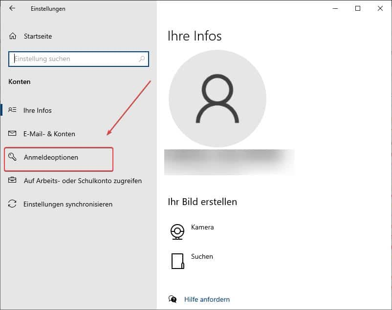

## Change your password in Windows
 
Today, in this article, “Change Windows password,” I would like to show you how to change your password in the Windows 10 system settings, as well as how to do this via the CMD command line or PowerShell. This option is a quick and easy way for administrators to change user passwords on a Windows computer or even across a domain.
## Option 1 – Change Windows password (company computer in a domain)
For anyone who has a Windows company computer that is part of a domain, the password can be changed as follows.
Simply press the following key combination:
**CTRL + ALT + DEL**
## Option 2 – Change password in Windows settings
In general, you can easily change your password via the system settings.
To do this, click on the Windows icon in the lower left corner of your desktop. In the Start menu, click on the **gear icon** and the Windows system settings window will open.
### Example in Windows 10


---

/en/posts/windows/cmd-befehle-im-ueberblick/
---


---


---
In this window, click on the **Accounts** option, then go to the menu item **Sign-in options -> Password** and click on Change**. If your PC is a member of a domain, you will be prompted to press the key combination CTRL + ALT + Del to change your password. As described in option 1.

## Change Windows password via CMD or Powershell (command line)
You can also easily change your password via the CMD command line, Powershell, or Microsoft Terminal.

### How to open the command line in Windows?
There are several ways to open the command line.
### Option 1:
Enter “CMD.exe” in the search field in the taskbar


### Option 2:
Press the Windows key + R and enter “CMD” in the Run window.


### Change Windows password via CMD for users without a domain
If you were able to open the command line successfully, you can now start changing your Windows password via the command line.
To do this, simply enter the following command in the command line. This will allow you to change the password, and the new password will be hidden when entered in the CMD.


```powershell
net user Name *
```


Of course, you can also assign a password without entering it hidden.


```powershell
net user Name NewPassword
```


### Change Windows password via CMD for users with a domain
To change the password for a user in a domain, you can enter the following command in the command line. Please note that this usually requires the command line CMD to be executed with administrator privileges.


```powershell
net user Name NewPassword /Domain
```
## Additional commands for the Windows command line CMD
Since many tasks can be performed faster or only via the command line, I have compiled a list of useful CMD commands in the article [**More than 50 CMD commands for Windows at a glance**](/en/posts/windows/cmd-befehle-im-ueberblick/), which you can also download.
